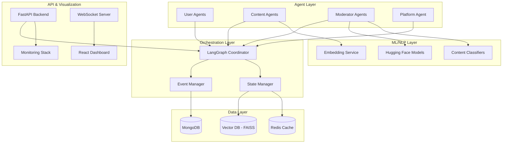

# SimuNet Design Document

## Overview

SimuNet is architected as a distributed multi-agent simulation platform that models social network dynamics through autonomous agents interacting in real-time. The system uses LangGraph for agent orchestration, vector databases for semantic content understanding, and event-driven architecture for scalable simulation of social media interactions.

The platform consists of four core agent types operating within a shared environment: User Agents simulate human behavior patterns, Content Agents represent posts with rich metadata, Moderator Agents enforce platform policies, and Platform Agents manage algorithmic feed ranking and recommendations.

## Architecture

### High-Level System Architecture



### Agent Architecture

Each agent type inherits from a base `SimuNetAgent` class that provides:
- State management and persistence
- Event publishing/subscription capabilities
- LangGraph integration for workflow execution
- Metrics collection and logging

**User Agents** simulate diverse user personas with configurable behavior patterns:
- Posting frequency and content preferences
- Engagement likelihood based on content similarity
- Network connection patterns and influence levels
- Susceptibility to misinformation and echo chambers

**Content Agents** encapsulate posts with rich semantic understanding:
- Text content with generated embeddings using sentence-transformers
- Metadata including topic classification, sentiment, and virality potential
- Misinformation scoring using fine-tuned detection models
- Engagement tracking and propagation mechanics

**Moderator Agents** implement configurable content policy enforcement:
- Multi-model content analysis pipeline (toxicity, hate speech, misinformation)
- Confidence-based decision making with human-in-the-loop escalation
- Policy adaptation based on false positive/negative feedback
- Audit trail generation for transparency and debugging

**Platform Agent** manages algorithmic content distribution:
- Feed ranking using configurable engagement vs. safety weights
- Recommendation systems based on user similarity and content embeddings
- A/B testing framework for policy experimentation
- Network effect modeling and viral content amplification

## Components and Interfaces

### Agent Communication Protocol

Agents communicate through a standardized event system built on Redis pub/sub:

```python
class AgentEvent:
    event_type: str  # "post_created", "content_flagged", "user_engaged"
    source_agent: str
    target_agents: List[str]
    payload: Dict[str, Any]
    timestamp: datetime
    correlation_id: str
```

### Content Processing Pipeline

Content flows through a multi-stage processing pipeline:

1. **Content Creation**: User agents generate posts using LLM-based content generation
2. **Semantic Analysis**: Content embeddings generated using sentence-transformers
3. **Classification**: Parallel processing for topic, sentiment, and safety classification
4. **Moderation Review**: Policy-based filtering with confidence thresholds
5. **Feed Integration**: Approved content enters recommendation and ranking systems

### State Management

The system maintains three types of state:

**Agent State**: Individual agent properties, behavior parameters, and interaction history
- Stored in MongoDB with agent-specific collections
- Cached in Redis for high-frequency access patterns
- Versioned for experiment reproducibility

**Content State**: Post metadata, engagement metrics, and propagation tracking
- Vector embeddings stored in FAISS for similarity searches
- Engagement time-series data in MongoDB for trend analysis
- Real-time metrics cached in Redis for dashboard updates

**Simulation State**: Global parameters, experiment configurations, and system metrics
- Configuration management for A/B testing scenarios
- Performance metrics and system health indicators
- Experiment audit logs and reproducibility metadata

## Data Models

### Core Data Schemas

```python
class UserAgent:
    agent_id: str
    persona_type: str  # "casual", "influencer", "bot", "activist"
    behavior_params: Dict[str, float]
    network_connections: List[str]
    engagement_history: List[str]
    created_at: datetime
    
class ContentAgent:
    content_id: str
    text_content: str
    embeddings: List[float]
    metadata: ContentMetadata
    engagement_metrics: EngagementMetrics
    moderation_status: ModerationStatus
    created_by: str
    created_at: datetime

class ContentMetadata:
    topic_classification: Dict[str, float]
    sentiment_score: float
    misinformation_probability: float
    virality_potential: float
    content_type: str  # "text", "image", "video", "link"

class EngagementMetrics:
    likes: int
    shares: int
    comments: int
    views: int
    engagement_rate: float
    propagation_depth: int
    reach: int

class ModerationStatus:
    is_flagged: bool
    violation_types: List[str]
    confidence_scores: Dict[str, float]
    action_taken: str  # "none", "warning", "shadow_ban", "remove"
    reviewed_by: str
    reviewed_at: datetime
```

### Vector Database Schema

FAISS indices organized by content type and temporal windows:
- **Content Embeddings**: 384-dimensional sentence-transformer vectors
- **User Preference Vectors**: Aggregated engagement patterns
- **Topic Clusters**: Hierarchical clustering for content categorization
- **Temporal Indices**: Time-windowed similarity searches for trending analysis

## Error Handling

### Fault Tolerance Strategy

**Agent Failures**: Individual agent failures are isolated using circuit breaker patterns
- Failed agents are automatically restarted with last known state
- Critical agents (Platform Agent) have hot standby replicas
- Graceful degradation when agent types become unavailable

**Data Consistency**: Eventual consistency model with conflict resolution
- Event sourcing for audit trails and state reconstruction
- Compensating transactions for failed multi-agent operations
- Periodic consistency checks and automated repair procedures

**External Service Failures**: Resilient integration with ML/NLP services
- Model inference caching to reduce external dependencies
- Fallback to simpler models when advanced services are unavailable
- Retry policies with exponential backoff for transient failures

### Monitoring and Alerting

**System Health Metrics**:
- Agent response times and throughput
- Event processing latency and queue depths
- Database connection pools and query performance
- Memory usage and garbage collection patterns

**Business Logic Metrics**:
- Content moderation accuracy (precision/recall)
- Engagement prediction accuracy
- Network clustering coefficients
- Misinformation spread velocity

## Testing Strategy

### Unit Testing

**Agent Behavior Testing**: Isolated testing of individual agent decision-making
- Mock event systems for deterministic behavior verification
- Property-based testing for edge case discovery
- Behavior verification against persona specifications

**Content Processing Testing**: Pipeline component validation
- ML model output validation with known test cases
- Embedding consistency and similarity threshold testing
- Classification accuracy benchmarking

### Integration Testing

**Multi-Agent Scenarios**: End-to-end workflow validation
- Predefined interaction sequences with expected outcomes
- Cross-agent communication protocol compliance
- State consistency verification across agent interactions

**Performance Testing**: Scalability and load validation
- Concurrent agent simulation with performance benchmarks
- Memory leak detection during extended simulations
- Database query optimization and index effectiveness

### Simulation Testing

**Experiment Reproducibility**: Deterministic simulation validation
- Fixed random seeds for consistent experimental results
- Configuration versioning and rollback capabilities
- Statistical significance testing for A/B experiments

**Emergent Behavior Validation**: Complex system behavior verification
- Network effect emergence under controlled conditions
- Misinformation spread pattern validation
- Policy effectiveness measurement across scenarios

### Research Validation

**Academic Standards Compliance**: Research methodology validation
- Statistical power analysis for experiment design
- Bias detection and mitigation strategies
- Ethical considerations for simulated social dynamics

**Benchmark Comparisons**: Validation against known social media phenomena
- Viral content spread pattern matching
- Echo chamber formation dynamics
- Moderation effectiveness baselines from literature

## Implementation Phases

### Phase 1: Core Infrastructure (Weeks 1-4)
- Basic agent framework and LangGraph integration
- MongoDB and Redis setup with core data models
- Simple content generation and basic moderation
- Minimal web interface for simulation monitoring

### Phase 2: Advanced Features (Weeks 5-8)
- ML-powered content classification and moderation
- Vector database integration for semantic similarity
- Policy experimentation framework
- Real-time visualization dashboard

### Phase 3: Scale and Research (Weeks 9-12)
- Kubernetes deployment and horizontal scaling
- Advanced analytics and research tool integration
- Performance optimization and monitoring
- Documentation and reproducibility features