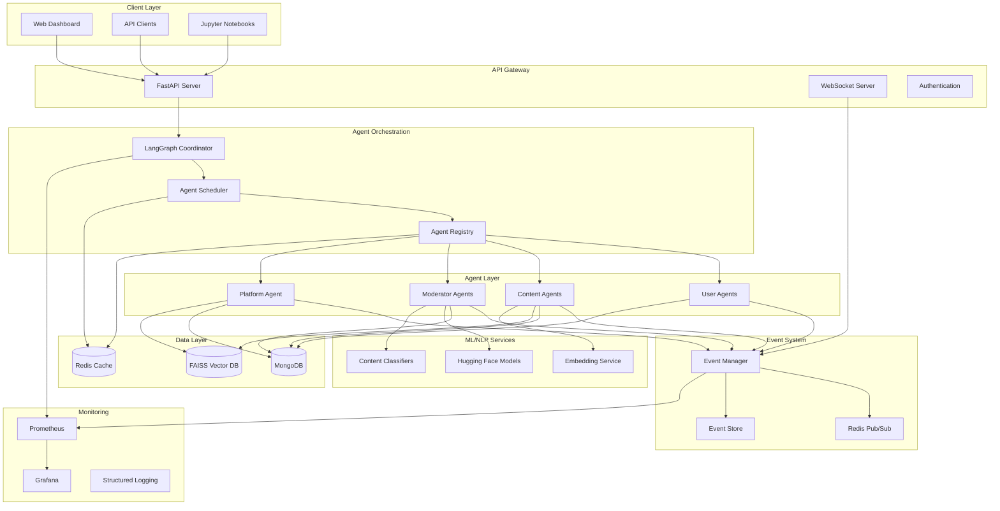

# SimuNet Architecture Documentation

## System Overview

SimuNet is designed as a distributed, event-driven multi-agent system that simulates social network dynamics. The architecture emphasizes scalability, modularity, and research reproducibility while maintaining real-time performance for large-scale simulations.

## Core Principles

### 1. Agent Autonomy
Each agent operates independently with its own decision-making logic, state management, and interaction patterns. Agents communicate through a standardized event system rather than direct method calls.

### 2. Event-Driven Architecture
All system interactions flow through a centralized event system, enabling loose coupling, audit trails, and easy integration of new agent types or behaviors.

### 3. Semantic Understanding
Content is processed through multiple NLP models to extract semantic meaning, enabling sophisticated recommendation algorithms and content analysis.

### 4. Research-First Design
Every component is designed with reproducibility, experimentation, and data export in mind, supporting rigorous academic research.

## System Architecture



## Component Details

### Agent Layer

#### Base Agent Framework
All agents inherit from `SimuNetAgent` which provides:

```python
class SimuNetAgent:
    """Base class for all SimuNet agents."""
    
    def __init__(self, agent_id: str, **kwargs):
        self.agent_id = agent_id
        self.state = AgentState()
        self.event_manager = EventManager()
        self.logger = structlog.get_logger()
        
    async def tick(self) -> None:
        """Main agent execution loop."""
        
    async def handle_event(self, event: AgentEvent) -> None:
        """Handle incoming events."""
        
    async def publish_event(self, event_type: str, payload: Dict) -> None:
        """Publish events to the system."""
```

**Key Features:**
- **State Management**: Persistent state with MongoDB backing
- **Event Handling**: Subscribe to and publish events
- **Lifecycle Management**: Initialization, running, and cleanup phases
- **Metrics Collection**: Built-in performance and behavior metrics
- **Error Handling**: Graceful failure recovery and circuit breakers

#### User Agents
Simulate human behavior with configurable personas:

```python
class UserAgent(SimuNetAgent):
    """Simulates human user behavior patterns."""
    
    def __init__(self, persona_type: PersonaType, **kwargs):
        super().__init__(**kwargs)
        self.persona_type = persona_type
        self.behavior_params = self._load_persona_config(persona_type)
        self.network_connections = []
        self.content_preferences = {}
```

**Persona Types:**
- **Casual**: Low posting frequency, moderate engagement
- **Influencer**: High posting frequency, high engagement, large network
- **Bot**: Automated behavior patterns, coordinated actions
- **Activist**: Topic-focused posting, high sharing behavior

**Behavior Simulation:**
- Content creation based on interests and trends
- Engagement decisions using similarity and social signals
- Network growth through mutual connections
- Temporal patterns (active hours, posting schedules)

#### Content Agents
Represent posts with rich semantic metadata:

```python
class ContentAgent(SimuNetAgent):
    """Represents content with semantic understanding."""
    
    def __init__(self, text_content: str, created_by: str, **kwargs):
        super().__init__(**kwargs)
        self.text_content = text_content
        self.created_by = created_by
        self.embeddings = None
        self.metadata = ContentMetadata()
        self.engagement_metrics = EngagementMetrics()
```

**Content Processing Pipeline:**
1. **Text Analysis**: Extract topics, sentiment, and linguistic features
2. **Embedding Generation**: Create semantic vectors using sentence-transformers
3. **Classification**: Detect misinformation, toxicity, and other harmful content
4. **Virality Prediction**: Estimate potential for viral spread
5. **Metadata Enrichment**: Add temporal, social, and contextual information

#### Moderator Agents
Implement configurable content moderation policies:

```python
class ModeratorAgent(SimuNetAgent):
    """Automated content moderation with configurable policies."""
    
    def __init__(self, policy_config: Dict, **kwargs):
        super().__init__(**kwargs)
        self.policy_config = policy_config
        self.classifiers = self._load_classifiers()
        self.decision_thresholds = policy_config.get("thresholds", {})
```

**Moderation Pipeline:**
1. **Content Analysis**: Run multiple NLP models in parallel
2. **Risk Assessment**: Combine classifier outputs with confidence scores
3. **Policy Application**: Apply configured thresholds and rules
4. **Action Decision**: Determine appropriate moderation action
5. **Audit Logging**: Record decisions with full reasoning chain

**Policy Configurations:**
- **Strict**: Low tolerance, high precision
- **Moderate**: Balanced approach with human escalation
- **Lenient**: High tolerance, focus on clear violations

#### Platform Agent
Manages algorithmic content distribution:

```python
class PlatformAgent(SimuNetAgent):
    """Algorithmic content distribution and feed management."""
    
    def __init__(self, **kwargs):
        super().__init__(**kwargs)
        self.ranking_algorithms = {}
        self.recommendation_engine = RecommendationEngine()
        self.ab_experiments = {}
```

**Core Functions:**
- **Feed Ranking**: Personalized content ordering
- **Recommendation Systems**: Content discovery algorithms
- **A/B Testing**: Policy experimentation framework
- **Viral Detection**: Identify trending and viral content
- **Engagement Optimization**: Balance engagement and safety

### Event System

#### Event Manager
Coordinates all inter-agent communication:

```python
class EventManager:
    """Centralized event coordination system."""
    
    def __init__(self):
        self.redis_client = redis.Redis()
        self.event_store = EventStore()
        self.subscribers = defaultdict(list)
        
    async def publish(self, event: AgentEvent) -> None:
        """Publish event to subscribers."""
        
    async def subscribe(self, agent_id: str, event_types: List[str]) -> None:
        """Subscribe agent to event types."""
```

**Event Types:**
- `content_created`: New content posted
- `content_interaction`: User engagement (like, share, comment)
- `moderation_action`: Content moderated or flagged
- `user_registered`: New user joined simulation
- `viral_detected`: Content reached viral threshold
- `experiment_started`: A/B test began
- `agent_error`: Agent encountered error

#### Event Store
Persistent event storage for audit trails and replay:

```python
class AgentEvent:
    """Standard event format for all agent communications."""
    
    event_id: str
    event_type: str
    source_agent: str
    target_agents: List[str]
    payload: Dict[str, Any]
    timestamp: datetime
    correlation_id: str
    metadata: Dict[str, Any]
```

### Data Layer

#### MongoDB Collections
- **agents**: Agent state and configuration
- **content**: Content metadata and engagement metrics
- **interactions**: User interaction history
- **experiments**: A/B test configurations and results
- **events**: Event audit trail
- **analytics**: Aggregated metrics and reports

#### Redis Usage
- **Pub/Sub**: Real-time event distribution
- **Caching**: Frequently accessed data (user feeds, trending content)
- **Session Management**: Agent state synchronization
- **Rate Limiting**: API and agent throttling

#### FAISS Vector Database
- **Content Embeddings**: 384-dimensional sentence-transformer vectors
- **User Preference Vectors**: Aggregated engagement patterns
- **Similarity Indices**: Optimized for real-time recommendations
- **Temporal Indexing**: Time-windowed similarity searches

### ML/NLP Services

#### Content Classification
Multiple specialized models for different aspects:

```python
class ContentClassifier:
    """Multi-model content analysis pipeline."""
    
    def __init__(self):
        self.toxicity_model = pipeline("text-classification", 
                                     model="unitary/toxic-bert")
        self.sentiment_model = pipeline("sentiment-analysis",
                                      model="cardiffnlp/twitter-roberta-base-sentiment")
        self.misinformation_model = self._load_misinformation_model()
        
    async def analyze_content(self, text: str) -> ContentAnalysis:
        """Run comprehensive content analysis."""
```

**Model Types:**
- **Toxicity Detection**: Identify harmful language
- **Hate Speech Detection**: Detect targeted harassment
- **Misinformation Detection**: Identify false or misleading claims
- **Sentiment Analysis**: Emotional tone classification
- **Topic Classification**: Content categorization
- **Language Detection**: Multi-language support

#### Embedding Service
Semantic vector generation for content understanding:

```python
class EmbeddingService:
    """Semantic embedding generation service."""
    
    def __init__(self):
        self.model = SentenceTransformer('all-MiniLM-L6-v2')
        self.cache = EmbeddingCache()
        
    async def generate_embeddings(self, texts: List[str]) -> List[List[float]]:
        """Generate semantic embeddings for text content."""
```

### Orchestration Layer

#### LangGraph Integration
Coordinates complex multi-agent workflows:

```python
from langgraph import StateGraph, END

def create_simulation_graph():
    """Create LangGraph workflow for simulation."""
    
    workflow = StateGraph(SimulationState)
    
    # Add agent nodes
    workflow.add_node("user_agents", process_user_agents)
    workflow.add_node("content_processing", process_content)
    workflow.add_node("moderation", moderate_content)
    workflow.add_node("platform_algorithms", run_platform_algorithms)
    
    # Define workflow edges
    workflow.add_edge("user_agents", "content_processing")
    workflow.add_edge("content_processing", "moderation")
    workflow.add_edge("moderation", "platform_algorithms")
    
    return workflow.compile()
```

#### Agent Scheduler
Manages agent execution timing and resource allocation:

```python
class AgentScheduler:
    """Manages agent execution scheduling and resource allocation."""
    
    def __init__(self):
        self.agent_registry = AgentRegistry()
        self.execution_queue = asyncio.Queue()
        self.resource_limits = ResourceLimits()
        
    async def schedule_agent_tick(self, agent_id: str) -> None:
        """Schedule agent for next execution cycle."""
```

## Scalability Architecture

### Horizontal Scaling
- **Agent Distribution**: Agents can run on different processes/machines
- **Event System**: Redis Cluster for distributed pub/sub
- **Database Sharding**: MongoDB sharding by agent type or time
- **Load Balancing**: Multiple API server instances

### Performance Optimization
- **Async Processing**: All I/O operations are asynchronous
- **Batch Operations**: Group database operations for efficiency
- **Caching Strategy**: Multi-level caching (Redis, in-memory)
- **Connection Pooling**: Optimized database connections

### Resource Management
- **Memory Limits**: Per-agent memory constraints
- **CPU Throttling**: Prevent agent monopolization
- **Queue Management**: Backpressure handling for events
- **Graceful Degradation**: Reduce functionality under load

## Security Architecture

### Authentication & Authorization
- **API Keys**: Service-to-service authentication
- **JWT Tokens**: User session management
- **Role-Based Access**: Different permission levels
- **Rate Limiting**: Prevent abuse and DoS attacks

### Data Protection
- **Encryption**: Data at rest and in transit
- **Audit Logging**: Complete action audit trail
- **Data Anonymization**: Remove PII from research exports
- **Backup Strategy**: Regular automated backups

### Network Security
- **TLS/SSL**: All external communications encrypted
- **Firewall Rules**: Restrict network access
- **VPN Access**: Secure remote administration
- **Container Security**: Isolated execution environments

## Monitoring & Observability

### Metrics Collection
```python
# Prometheus metrics examples
agent_tick_duration = Histogram('agent_tick_duration_seconds')
content_processed_total = Counter('content_processed_total')
engagement_rate = Gauge('current_engagement_rate')
```

### Logging Strategy
```python
# Structured logging with context
logger.info(
    "Content moderated",
    content_id=content_id,
    action="shadow_ban",
    confidence=0.85,
    model_version="v2.1",
    processing_time_ms=150
)
```

### Health Checks
- **Agent Health**: Individual agent status monitoring
- **System Health**: Overall system performance metrics
- **Data Quality**: Content and interaction validation
- **External Services**: ML model availability and performance

## Deployment Architecture

### Container Strategy
```dockerfile
# Multi-stage build for optimization
FROM python:3.9-slim as base
FROM base as dependencies
FROM dependencies as application
```

### Kubernetes Deployment
```yaml
apiVersion: apps/v1
kind: Deployment
metadata:
  name: simu-net-agents
spec:
  replicas: 3
  selector:
    matchLabels:
      app: simu-net-agents
  template:
    spec:
      containers:
      - name: agent-runner
        image: simu-net:latest
        resources:
          requests:
            memory: "512Mi"
            cpu: "250m"
          limits:
            memory: "1Gi"
            cpu: "500m"
```

### Environment Management
- **Development**: Single-node deployment with mock services
- **Staging**: Multi-node deployment with production-like data
- **Production**: Full distributed deployment with monitoring
- **Research**: Specialized configuration for academic use

## Future Architecture Considerations

### Planned Enhancements
- **Multi-Region Deployment**: Global simulation distribution
- **Real-Time Analytics**: Stream processing with Apache Kafka
- **Advanced ML Pipeline**: MLOps integration with model versioning
- **Blockchain Integration**: Decentralized content verification
- **Edge Computing**: Reduce latency for real-time interactions

### Research Extensions
- **Federated Learning**: Distributed model training
- **Differential Privacy**: Privacy-preserving analytics
- **Quantum Computing**: Advanced optimization algorithms
- **AR/VR Integration**: Immersive simulation visualization